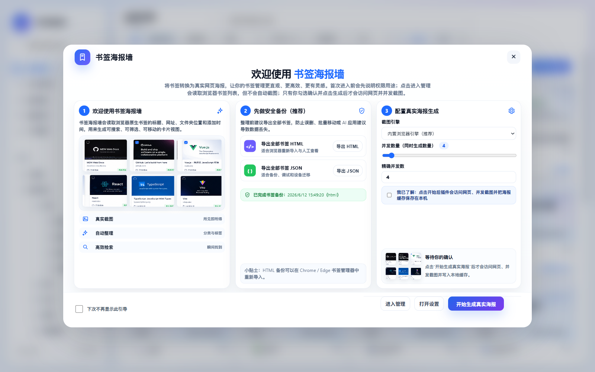
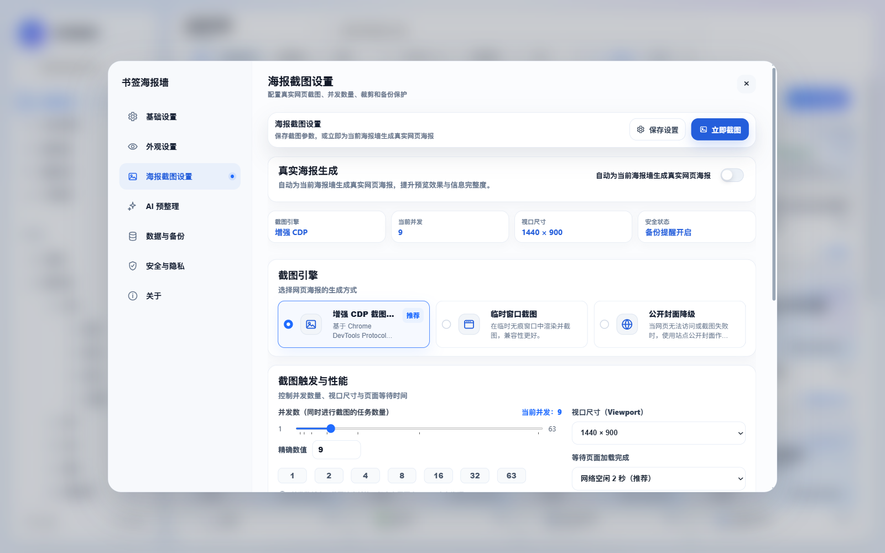

# BookmarkWall / 书签海报墙

BookmarkWall 是一个 Manifest V3 浏览器扩展，用海报墙的方式整理 Chrome / Edge 原生书签。它会把书签展示成可搜索、可筛选、可移动的卡片，并在用户明确同意后为网页生成真实截图海报。

> English summary: BookmarkWall is a local-first Chrome/Edge bookmark organizer that turns native bookmarks into a searchable poster wall with optional real webpage screenshots and optional OpenAI-compatible AI suggestions.

## 特性

- 原生书签管理：读取浏览器书签树，支持搜索、排序、文件夹筛选、最近添加、未分类和重复书签检测
- 海报墙视图：统一 16:9 或竖向海报卡片，优先展示本地预览，授权后生成真实网页截图
- 整理操作：多选、拖拽移动、编辑标题/URL、删除、撤销和批量移动
- 安全备份：首次引导和设置页都提供全部书签 HTML / JSON 导出
- 截图管线：支持增强 CDP 后台截图、手动临时窗口补拍、公开网页封面、本地设计海报兜底
- 并发控制：截图队列支持 1-63 并发，可停止，并显示进度
- 可选 AI：支持 OpenAI-Compatible API，默认关闭，建议必须预览确认后才会应用
- 本地优先：书签、截图缓存、设置和 API Key 保存在本机扩展存储中
- 无构建依赖：原生 HTML / CSS / JavaScript，无前端框架和远程运行时依赖

## 截图

| 首次引导 | 海报墙主页 |
| --- | --- |
|  |  |

| 设置页 | AI 预整理 |
| --- | --- |
|  |  |

## 安装

### 从源码加载

1. 下载或克隆本仓库
2. 打开 `chrome://extensions/` 或 `edge://extensions/`
3. 开启“开发者模式”
4. 点击“加载已解压的扩展程序”
5. 选择项目根目录
6. 点击扩展图标打开 BookmarkWall

首次进入时，扩展会先显示引导页。确认前它不会读取完整书签树、不会访问书签网页，也不会启动截图队列。勾选截图授权并点击开始后，才会为当前可见书签生成真实海报。

### 从 ZIP 加载

如果你已经有发布包，可以在扩展管理页选择解压后的 ZIP 内容目录。可安装包应至少包含：

```text
manifest.json
index.html
background.js
src/
assets/
docs/
README.md
LICENSE
package.json
```

## 开发

项目不需要构建步骤。修改文件后，在扩展管理页点击刷新即可重新加载。

```bash
npm run check
npm test
```

脚本说明：

- `npm run check`：检查主要 JavaScript 文件语法
- `npm test`：运行工具函数、Manifest 和 UI 配置相关测试

目录结构：

```text
index.html              扩展主页面
background.js           MV3 service worker，点击扩展图标时打开或切回主页面
manifest.json           扩展清单和权限声明
src/app.js              主应用逻辑、截图队列、AI 设置和交互
src/bookmark-utils.js   书签树处理、URL 归一化和本地推荐工具
src/styles.css          主界面样式
assets/                 扩展图标、SVG 图标源文件和首次引导预览图
docs/                   隐私、开发、测试、发布和设计说明
tests/                  Node.js 静态测试
```

## 打包

可以用 PowerShell 生成本地测试包：

```powershell
New-Item -ItemType Directory -Force dist | Out-Null
Compress-Archive -Force -Path manifest.json,index.html,background.js,src,assets,docs,README.md,LICENSE,package.json -DestinationPath dist/bookmarkwall-0.7.10.zip
```

建议不要把 `dist/`、本地调试目录和参考素材提交到 GitHub。发布版本可以通过 GitHub Releases 上传 ZIP。

## 权限说明

BookmarkWall 申请的权限都用于本地书签整理和海报生成：

- `bookmarks`：读取、移动、重命名和删除浏览器原生书签
- `storage` / `unlimitedStorage`：保存设置、截图缓存、AI 建议和本地状态
- `tabs` / `activeTab`：创建截图标签页、恢复原标签页、打开或切回主页面，并执行备用截图
- `tabGroups`：把批量截图临时标签页收进折叠的“BookmarkWall 截图工作区”，减少标签栏干扰
- `scripting`：截图前滚动页面到顶部，减少截到中间位置的概率
- `debugger`：通过 Chrome DevTools Protocol 生成真实网页截图
- `http://*/*` / `https://*/*`：访问用户书签对应网页，用于截图或读取公开封面

更多说明见 [隐私与权限说明](docs/PRIVACY.md) 和 [商店上架材料草案](docs/STORE_LISTING.md)。

## 隐私边界

- 扩展不会把书签、截图缓存、设置或 API Key 上传到开发者服务器
- 真实网页截图只在用户同意后生成，并保存到本地扩展存储
- AI 预整理默认关闭，只有用户主动配置并触发时才会发送必要书签信息
- AI 请求默认只包含标题、域名、URL 路径、当前文件夹和可选目标文件夹列表
- 用户可以随时导出书签备份、清除截图缓存和清除 AI 推荐记录

## 文档

- [开发文档](docs/DEVELOPMENT.md)
- [测试说明](docs/TESTING.md)
- [隐私与权限说明](docs/PRIVACY.md)
- [首次引导与截图授权说明](docs/ONBOARDING_AND_CONSENT.md)
- [本地兜底海报设计说明](docs/FALLBACK_POSTER_DESIGN.md)
- [Release Notes](docs/RELEASE_NOTES.md)

## 贡献

欢迎提交 issue 和 pull request。开始之前建议先阅读 [CONTRIBUTING.md](CONTRIBUTING.md)，并至少运行：

```bash
npm run check
npm test
```

由于这是浏览器扩展，涉及书签、截图、权限和可选 AI 数据发送，任何改动都应优先保证用户知情、可撤销、本地优先。

## License

本项目使用 [MIT License](LICENSE)。
